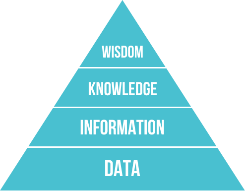

# Lista de Exercícios sobre conceitos de Mineração de Dados Classificação

1. Descreva a pirâmide de conhecimento de Ackoff ?
    
    - Conhecida como modelo de Dikw(Data,Information,Knowledg, wisdon) em português = Dados, informação, conhecimento e sabedoria
    
    
</br>

2. O que é Big data? Quais os seus principais atributos?
    - Big data refere-se a conjuntos de dados que são muito grandes ou complexos para serem tratados por softwares tradicionais de processamento de dados . Dados com muitos campos (linhas) oferecem maior poder estatístico , enquanto dados com maior complexidade (mais atributos ou colunas) podem levar a uma maior taxa de falsa descoberta .

    - O big data foi originalmente associado a três conceitos-chave: volume , variedade e velocidade .

    ## Principais atributos

    - <b>Volume</b> : A quantidade de dados gerados e armazenados. O tamanho dos dados determina o valor e o insight potencial, e se pode ser considerado big data ou não. O tamanho do big data geralmente é maior que terabytes e petabytes.

    - <b>Variedade</b> : O tipo e a natureza dos dados
    
    - <b>Velocidade</b> : A velocidade com que os dados são gerados e processados ​​para atender às demandas e desafios que estão no caminho do crescimento e desenvolvimento. 
    
    - <b>Veracidade</b> : A veracidade ou confiabilidade dos dados, que se refere à qualidade dos dados e ao valor dos dados. 
    
    - <b>Valor</b> : O valor em informação que pode ser alcançado pelo processamento e análise de grandes conjuntos de dados. 
    
    - <b>Variabilidade</b> : A característica da mudança de formatos, estrutura ou fontes de big data. 
    
    - <b>Exaustivo</b> : Big data pode ou não incluir todos os dados disponíveis das fontes
    
    - <b>Refinado e exclusivamente lexical</b>: Respectivamente, a proporção de dados específicos de cada elemento por elemento coletado e se o elemento e suas características estão devidamente indexados ou identificados.
    
    - <b>Relacional</b> : Se os dados coletados contiverem campos comuns que permitiriam uma junção, ou meta-análise, de diferentes conjuntos de dados.
    
    - <b>Extensão</b> : Se novos campos em cada elemento dos dados coletados podem ser adicionados ou alterados facilmente.
    
    - <b>Escalabilidade</b>: Se o tamanho do sistema de armazenamento de big data pode se expandir rapidamente.
3. O que é mineração de dados?
    
    - Mineração de dados é um algoritmo.

        * É o processo de extração e descoberta de padrões em grandes conjuntos de dados envolvendo métodos na interseção de aprendizado de máquina , estatística e sistemas de banco de dados .

4. O que é data warehouse e qual é a sua relação com mineração de dados?
    - O que é data warehouse : Um data warehouse é um tipo de sistema de gerenciamento de dados projetado para ativar e fornecer suporte às atividades de business intelligence (BI), especialmente a análise avançada. Os data warehouses destinam-se exclusivamente a realizar consultas e análises avançadas e geralmente contêm grandes quantidades de dados históricos. Os dados em um data warehouse geralmente são derivados de uma ampla variedade de fontes, como arquivos de log de aplicativos e aplicativos de transações.

    - Relação entre mineração de dados é que como o waehouse é um sistema de gerenciamento de dados então tem como buscar uma base para fazer a analise e reconhecimento do mesmo.

5. Contextualize a utilização de mineração de dados em uma organização que usa OLTP e OLAP.
    
    - OLAP :  O processamento analítico online (OLAP)  é um sistema para realizar análises multidimensionais em alta velocidade em grandes volumes de dados. Normalmente, esses dados são de um data warehouse , data mart ou algum outro armazenamento de dados centralizado. O OLAP é ideal para mineração de dados , inteligência de negócios e cálculos analíticos complexos, bem como funções de relatórios de negócios, como análise financeira, orçamento e previsão de vendas.

    - O processamento transacional online (OLTP) permite a execução em tempo real de um grande número de transações de banco de dados por um grande número de pessoas, normalmente pela Internet. Os sistemas OLTP estão por trás de muitas de nossas transações diárias, de caixas eletrônicos a compras em lojas e reservas de hotéis. Os sistemas OLTP usam um banco de dados relacional

6. Descreva ao menos cinco tipos de problemas/tarefas distintos em mineração de dados.
    
    1. Mineração de vários tipos de conhecimento em bancos de dados - Os requisitos de diferentes usuários são diferentes. Diferentes tipos de conhecimento podem despertar o interesse de diferentes usuários. Como resultado, a mineração de dados deve abranger uma ampla gama de tarefas de descoberta de conhecimento.

    2. Mineração de conhecimento interativa em vários níveis de abstração - Por permitir que os usuários se concentrem na busca de padrões, fornecendo e refinando solicitações de mineração de dados com base nos resultados retornados, o processo de mineração de dados deve ser interativo.

    3. Conhecimento básico - Isso pode ser usado para expressar padrões descobertos não apenas em termos concisos, mas em vários níveis de abstração para orientar o processo de descoberta e expressar padrões descobertos.

    4. Mineração de dados ad-hoc e linguagens de consulta de mineração de dados - Uma linguagem de consulta de mineração de dados que permite aos usuários descrever tarefas de mineração ad-hoc deve ser integrada a uma linguagem de consulta de data warehouse e otimizada para mineração de dados eficiente e flexível.

    5. Apresentação e visualização dos resultados da mineração de dados - Uma vez identificados os padrões, eles devem ser expressos em linguagens de alto nível e representações visuais. Os usuários devem ser capazes de entender facilmente essas representações

    6. Manipulação de dados ruidosos ou incompletos - Métodos de limpeza de dados que podem manipular ruídos e objetos incompletos enquanto são necessárias regularidades de dados de mineração. Sem métodos de limpeza de dados, a precisão dos padrões descobertos será baixa.

    7. Manipulação de dados ruidosos ou incompletos - Métodos de limpeza de dados que podem manipular ruídos e objetos incompletos enquanto são necessárias regularidades de dados de mineração. Sem métodos de limpeza de dados, a precisão dos padrões descobertos será baixa.

    8. Avaliação de padrões - Refere-se ao interesse do problema. Os padrões descobertos devem ser interessantes porque representam conhecimento comum ou falta de novidade.

7. Em que tipo de problemas um algoritmo de classificação  ́e  ́uti ?
    
    * Os algoritmos de classificação são usados ​​em algoritmos de classificação determinísticos para ordenar os itens na lista classificada.
    
    * Os algoritmos de classificação também são usados ​​em sistemas de recomendação para recomendar itens nos quais um usuário podem se interessar.  

8. Quais são as consequências para Mineração de Dados quando temos poucos recursos de memória principal e
quando temos pouca memória secundária ?
    
    - Dados impresisos e a chance de travar o sistema ocasionando overflow na memoria principal, e também lentidão na memoria secundaria.

9. Defina o problema de classificação. Cite quatro situações reais que podem ser descritas na forma de um
problema de classificação.
    
    - O problema de classificação são aqueles onde se busca encontrar uma classe, dentro de uma possibilidades limitadas existentes.

    1. Titanic quantas pessoas sobrevivel e quantas não
    2. Classificar quais valores estão sendo mais gasto em determinada conta governamental
    3. Carros e quais são as variações de preço deles em relação a tabela fip
    4. Verificar fraudes na base do auxilio brasil onde podemos pegar quais pessoas receberam comparando com o imposto de renda de cada e se ela realmente não estava trabalhando na epoca 

10. Descreva os três principais componentes de um algoritmo de aprendizado de máquina.
    1. Aprendizado Supervisionado
    2. Aprendizado Não Supervisionado
    3. Aprendizagem por reforço
11. Qual  ́e a diferença entre aprendizado supervisionado e aprendizado não supervisionado. Dê um exemplo.
    
    - Note que a característica básica de sistemas de aprendizado supervisionado é que os dados que utilizamos para treiná-los contém a resposta desejada, isto é, contém a variável dependente resultante das variáveis independentes observadas.
    
    - Aprendizado não supervisionado queremos achar uma representação mais informativa dos dados que temos. Geralmente, essa representação mais informativa é também mais simples, condensando a informação em pontos mais relevantes.

    - A diferença entre a duas são que a aprendizagem não supervisionado é aquele que não sabemos quais padrões existem então não temos um parametro de analise pré defenido.

12. Defina a medida de acurácia de um classificador.
    
    - Basta verificar a porcentagem de acerto do classificador.

    - Exemplo: Por exemplo, se das 286 amostras da base de cancer, o classificador acertou 230, teremos uma acurácia final de (230/286) x 100 = 80,42%.

13. Descreva os passos de como aplicar mineração de dados na prática
    
    1. Ajustar os dados de acordo com o que deseja
    2. Analisar um ponto de referencia
    3. Fazer a classificação
    4. Usar uma ferramenta de classificação
    5. Verificar a acurácia da classificação

14. Escreva um algoritmo para fazer o treino usando o algoritmo Zero-Regras e um algoritmo para aplicar o
aprendizado Zero-Regras em uma base de exemplos medindo sua acurácia

    ```{r}
        library(tidymodels)
        library(tidyr)
        library(dplyr)
        library(readr)
        df <- data.frame(team=rep(c('A', 'B', 'C', 'D'), each=4),
                    pos=rep(c('G', 'F'), times=8),
                    points=round(runif(16, 4, 20),0))

        df <- df |> mutate(regra = "Dados Caros")
        df$regra[df$points <= 10] <-  "Dados Baratos"

        #Algoritimo Zero Regras
        notRules <- df

        #COM CLASSIFICAÇÃO

        classificadors <- function(dataBase){
            if( dataBase["points"] > 12 ){
                return("Dados Caros")
            }else{
                return("Dados Baratos")
            }
        }

        resultadoss <- apply(df, MARGIN = 1, FUN = classificadors)

        acuracias  = sum(resultadoss == df$regra)/nrow(df)  # proporcao das observações que foram 
        
        classificadas corretamente
        print(acuracias)

        # 0.8125 DE ACURACIA

    ```

15. O que é aprendizado indutivo? Em quais situações o uso de aprendizado indutivo é indicado?
    - Aprendizado indutivo onde deve-se aprender sem a presença de regras, tentar determinar o padrão e inserir uma regra.

    - Em situações onde não existe um pré processamento onde devemos pegar a saida X e encontrar a f(x) assim retornando os dados.

16. O que  ́e overfitting?

    - O overfitting é um conceito em ciência de dados, que ocorre quando um modelo estatístico se ajusta exatamente aos seus dados de treinamento. Quando isso acontece, o algoritmo infelizmente não pode funcionar com precisão contra dados não vistos, anulando seu propósito. A generalização de um modelo para novos dados é, em última análise, o que nos permite usar algoritmos de aprendizado de máquina todos os dias para fazer previsões e classificar dados.


